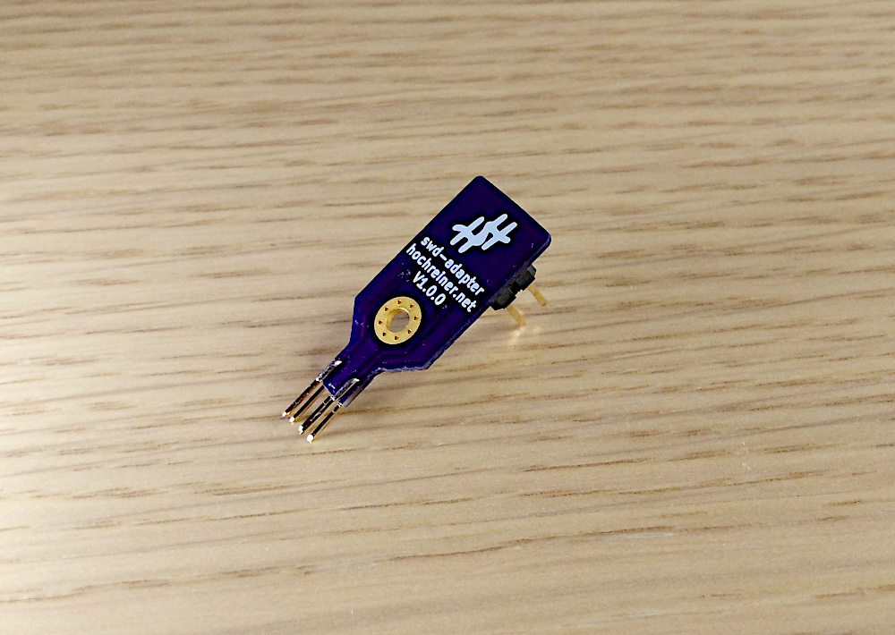

# SWD-Adapter

This is an adapter board for a five-pin SWD connector I used in some of my projects.

**Note:** The board is designed for 0.8 mm PCBs.
1.6 mm PCBs, as are common with many PCB manufacturers will not work.
